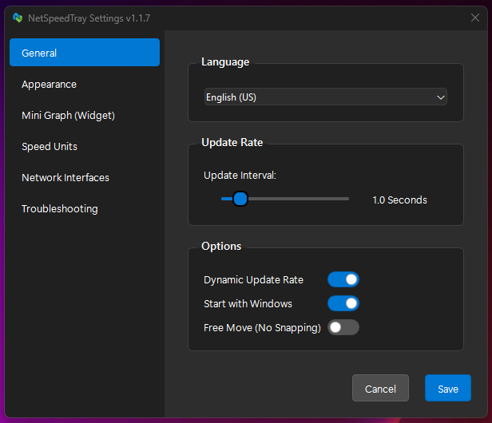
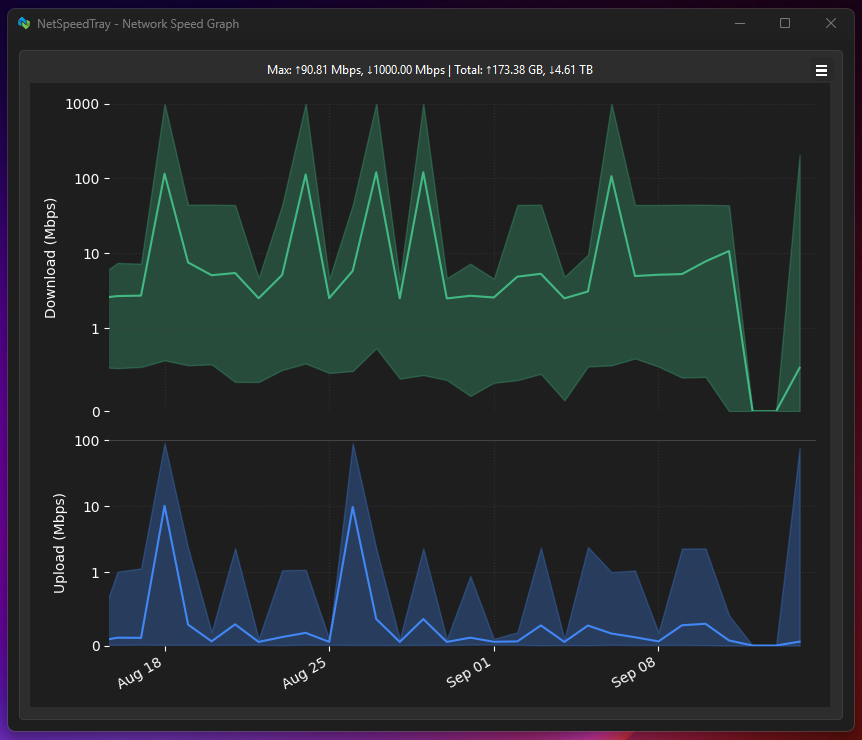

# NetSpeedTray

  [](https://github.com/microsoft/winget-pkgs)  


A lightweight, open-source network monitor for Windows that displays live upload/download speeds directly on the Taskbar. It's the feature Windows forgot.

---

## Sponsors

This program uses free code signing provided by [SignPath.io](https://signpath.io/), certificate by [SignPath Foundation](https://signpath.org/).


## Installation

The easiest way to install and get automatic updates is with a package manager.

**Using [Winget](https://docs.microsoft.com/en-us/windows/package-manager/winget/) (Recommended, built into Windows):**

```powershell
winget install --id erez-c137.NetSpeedTray
```

### Manual Download
If you prefer, you can download the latest files directly from the [**Releases Page**](https://github.com/erez-c137/NetSpeedTray/releases/latest).

-   **`NetSpeedTray-x.x.x-Setup.exe`:** The standard Windows installer. Recommended for most users.
-   **`NetSpeedTray-x.x.x-Portable.zip`:** The portable version. No installation needed—just extract the folder and run `NetSpeedTray.exe`.

---

## Key Features

-   ⚡ **High-Performance & Efficient:**
    -   **NumPy Vectorization:** Uses optimized vectorized operations for near-instant graph rendering and zero-latency UI interaction, even with years of data.
    -   **Dynamic Update Rate:** Automatically reduces polling frequency when the network is idle to conserve CPU and extend battery life.
    -   **Global Debouncing:** Every adjustment feels snappy thanks to an intelligent input debouncing system that prevents UI thread freezes.

-   ✨ **Modern Native Look & Feel:**
    -   **Fluent Design Sliders:** Designed to blend perfectly with Windows 10/11 UI using modern Fluent-inspired controls.
    -   **Auto-Theme Detection:** Intelligently switches text and background colors based on your taskbar theme (Light/Dark/Mixed) for perfect visibility.

-   🚀 **Intelligent & Adaptive Positioning:**
    -   **Auto-Shift:** The widget finds empty space next to your system tray and automatically shifts to make room for new icons.
    -   **Z-Order Excellence:** Stays on top of the taskbar but gracefully hides when you use **Fullscreen applications** or open system menus (Start Menu, Action Center).
    -   **Tray Offset Control:** Fine-tune exactly where the widget sits relative to the system tray overflow button.

-   📈 **Smart Network Monitoring:**
    -   **Auto-Primary Mode:** The default mode intelligently identifies your main internet connection, ignoring "noise" from internal VPNs or virtual machine adapters.
    -   **Physical vs. Virtual Filtering:** Choose to monitor all hardware, specific interfaces, or include virtual adapters for power-user transparency.

-   🎨 **Total Visual Customization:**
    -   **Free Move Mode:** Unlock the widget and place it anywhere—on another monitor or a specific spot on your desktop.
    -   **Optional Mini-Graph:** Display a real-time area chart of recent activity directly on the widget with adjustable opacity and gradient fills.
    -   **Arrow Styling:** Granular control over arrow symbols—customize their font, size, and weight independently of the speed values.
    -   **Color Coding:** Set custom speed thresholds and colors to visualize network load at a glance.

-   ✍️ **Granular Display Control:**
    -   **Centralized Unit System:** Choose between Bits (Mbps), Bytes (MB/s), Binary (MiB/s), or Decimal units.
    -   **Precision Padding:** Control decimal places (0-2) and toggle fixed-width values to prevent layout jitter as numbers change.
    -   **Layout Options:** Align text (left/center/right) and toggle unit suffixes or activity arrows for a minimalist look.

-   📊 **Advanced History Graph:**
    -   **Dual-Axis Area Charts:** Split view for Download and Upload ensures both are visible even when speeds are asymmetric.
    -   **Symlog Scaling:** A dynamic logarithmic scale lets you see fine-grained detail in low-level traffic while still handling massive Gigabit spikes.
    -   **Time-Dynamic Rendering:** Automatically switches between detailed line plots and "Mean & Range" plots for long-term historical trends.
    -   **Data Export:** Export your history to `.csv` or save a high-resolution `.png` of your network activity.

-   🌍 **Globally Localized:**
    -   Full support for **9+ languages** (Korean, French, German, Russian, Spanish, Dutch, Polish, Slovenian, and English).
    -   **100% Key Parity:** Every language is fully translated—no missing keys or English placeholders in any supported locale.

-   🛡️ **Trusted & Secure:**
    -   **Digitally Signed:** Verified by [SignPath Foundation](https://signpath.org/) to guarantee code integrity and eliminate Windows SmartScreen warnings.
    -   **100% Open Source:** No ads, no tracking, no telemetry. Just your data, on your machine.

## Usage & Screenshots

#### The Widget

The core of NetSpeedTray. It sits on your taskbar, showing your live network speeds.

-   **Right-click** to access Settings or Exit.
-   **Double-click** to open the full history graph.
-   **Left-click and drag** to adjust its position along the taskbar.

<div align="center">
  <br/>
</div>

#### Modern Settings

A clean, modern UI to control every aspect of the widget's appearance and behavior.

<div align="center">
  <br/>
</div>

#### Detailed History Graph

Double-click the widget to see a detailed, filterable graph of your network history.

<div align="center">
  <br/>
</div>

---

## ☕ Support A Tool You Use Every Day

Let’s be real: Windows should have had this feature built-in. NetSpeedTray is my answer: a lightweight, bloat-free solution that feels like it belongs, crafted with hundreds of hours of development and debugging.

This project is a labor of love, and it will **always be free, open-source, and ad-free.**

If you get daily value from this little widget, please consider supporting its future. Your contribution is a powerful way to say "thank you" and directly funds the time spent on new features and long-term maintenance.

<p align="center">
  <a href="https://github.com/sponsors/erez-c137">
    
  </a>
   
  <a href="https://ko-fi.com/erezc137">
    
  </a>
   
  <a href="https://buymeacoffee.com/erez.c137">
    
  </a>
</p>

Can't contribute financially? No problem! **Sharing & Starring the repo** on GitHub is a free and hugely appreciated way to show your support. ❤️

---

## Building from Source

<details>
<summary>Click to expand</summary>

### Prerequisites

-   [Python 3.11+](https://www.python.org/downloads/)
-   [Git](https://git-scm.com/downloads/)
-   (Optional but Recommended) [Inno Setup 6](https://jrsoftware.org/isinfo.php) for building the final Windows installer.

### Development & Build Instructions

1.  **Clone the Repository:**

    ```bash
    git clone https://github.com/erez-c137/NetSpeedTray.git
    cd NetSpeedTray
    ```

2.  **Create and Activate a Virtual Environment:**

    ```powershell
    # PowerShell (Recommended on Windows)
    python -m venv .venv
    .\.venv\Scripts\Activate.ps1
    ```

    ```bash
    # CMD
    python -m venv .venv
    .\.venv\Scripts\activate.bat
    ```

3.  **Install All Dependencies:**
    This project uses `pip-tools` for specific version pinning. To set up your environment, simply run:

    ```bash
    pip install -r dev-requirements.txt
    ```

    > **Note for Python 3.13+ Users:** If you are using a pre-release version of Python (e.g., 3.14), you may need to install dependencies with the `--pre` flag if stable wheels are not yet available:
    > `pip install --pre -r dev-requirements.txt`

4.  **Run the Application from Source:**

    ```bash
    python src/monitor.py
    ```

5.  **Run the Test Suite (Optional):**

    ```bash
    pytest -v
    ```

6.  **Build the Executable and Installer (Optional):**
    -   Ensure Inno Setup 6 is installed and in your system's PATH.
    -   Run the automated build script:
    ```bash
    .\build\build.bat
    ```
    -   The final installer and portable executable will be created in the `dist` folder.

</details>

## Contributing

Contributions, issues, and feature requests are welcome! Please feel free to open an issue or submit a pull request.

> **A Note on System UI Integration:** To ensure a clean and predictable experience, NetSpeedTray is designed to integrate seamlessly with core Windows UI. Due to how Windows layers its system menus, elements like the Start Menu and Action Center will always appear on top.
>
> Instead of being awkwardly covered, the widget will gracefully hide when these menus are active and **reappear instantly** the moment they are closed. This behavior is intentional and ensures the widget feels like a polished, non-intrusive part of the operating system.

## License

This project is licensed under the [GNU GPL v3.0](LICENSE).