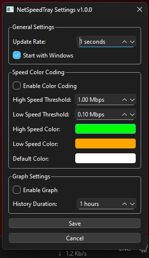

# Network Speed Tray Monitor

A lightweight system tray application that monitors and displays real-time network speeds with customizable features.

## Screenshots

<p align="center">
  <br>
  <em>Main interface in system tray</em>
</p>

<p align="center">
  <br>
  <em>Settings dialog with customization options</em>
</p>

<p align="center">
  <br>
  <em>Optional speed history graph</em>
</p>

## Features

- 💻 System tray integration
- 📊 Real-time upload/download speed monitoring
- 🎨 Customizable color coding based on speed thresholds
- 📈 Optional speed history graph
- 🚀 Drag-and-drop positioning
- ⚙️ Configurable update rates
- 🔄 Auto-start with Windows option

## Download

- [Latest Release](https://github.com/erez-c137/NetSpeedTray/releases/latest)
  - **NetSpeedTray-Portable.zip** - Portable version, just extract and run
  - **NetSpeedTray-Setup.exe** - Windows installer

## Installation

### Option 1: Portable Version (Recommended)

1. Download `NetSpeedTray-Portable.zip`
2. Extract anywhere
3. Run `NetSpeedTray.exe`

### Option 2: Windows Installer

1. Download `NetSpeedTray-Setup.exe`
2. Run the installer
3. Follow the installation wizard

## Usage

- Right-click the tray icon for settings
- Left-click and drag to reposition
- Settings are automatically saved
- Speed updates in real-time

## Building from Source

### Prerequisites

- Windows OS
- Python 3.11+
- Inno Setup (for installer)

### Setup

```bash
# Clone repository
git clone https://github.com/erez-c137/NetSpeedTray.git
cd NetSpeedTray

# Install requirements
pip install -r requirements.txt

# Build all distributions
build.bat
```

## Contributing

Contributions are welcome! Please feel free to submit pull requests.

## License

[MIT License](LICENSE)
