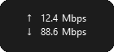
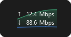
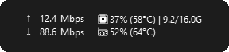
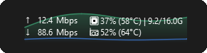
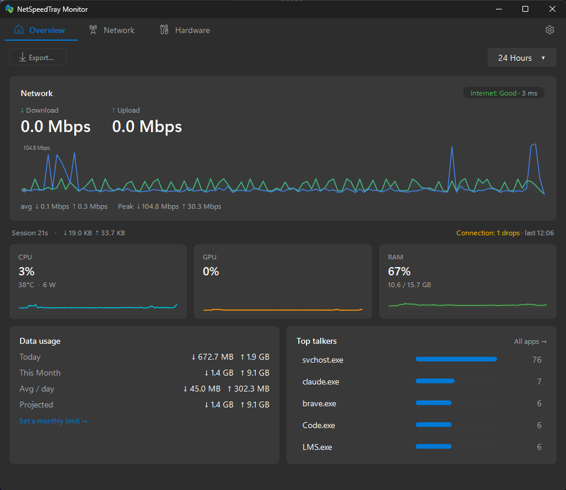
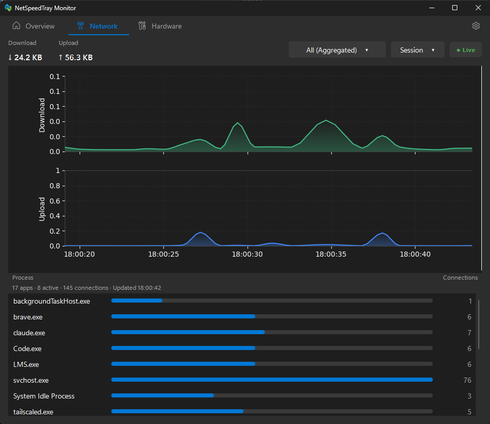
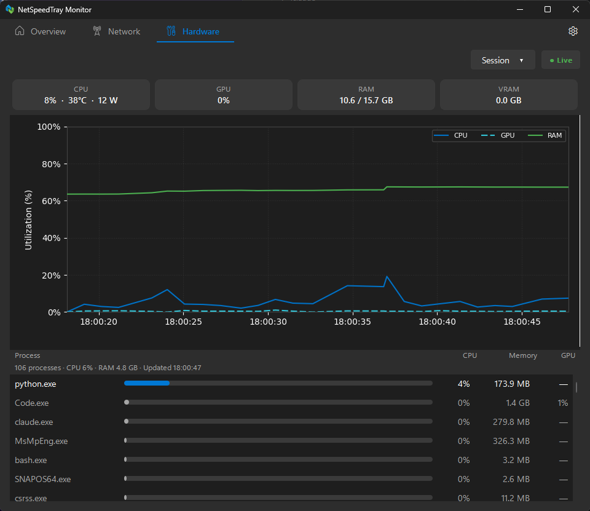
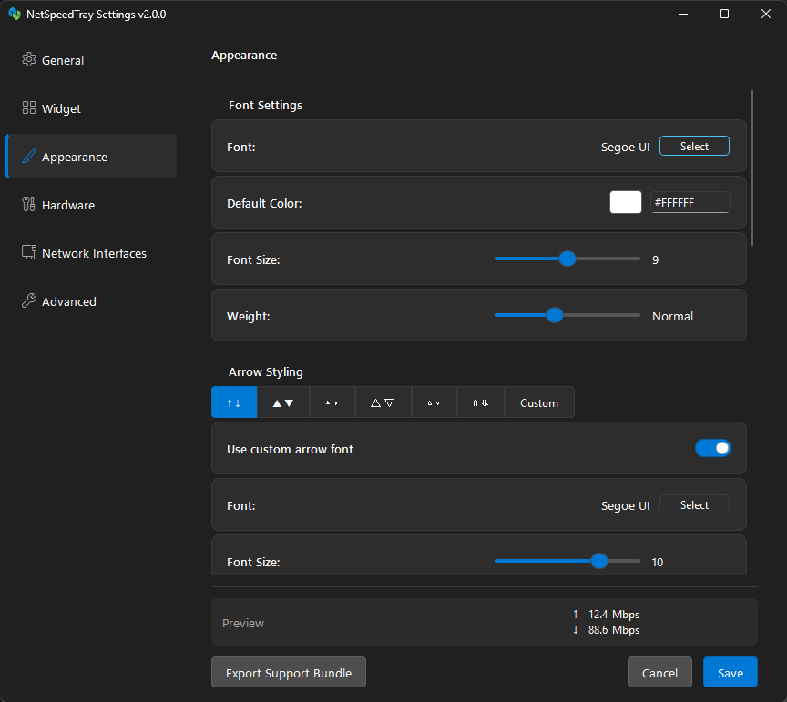
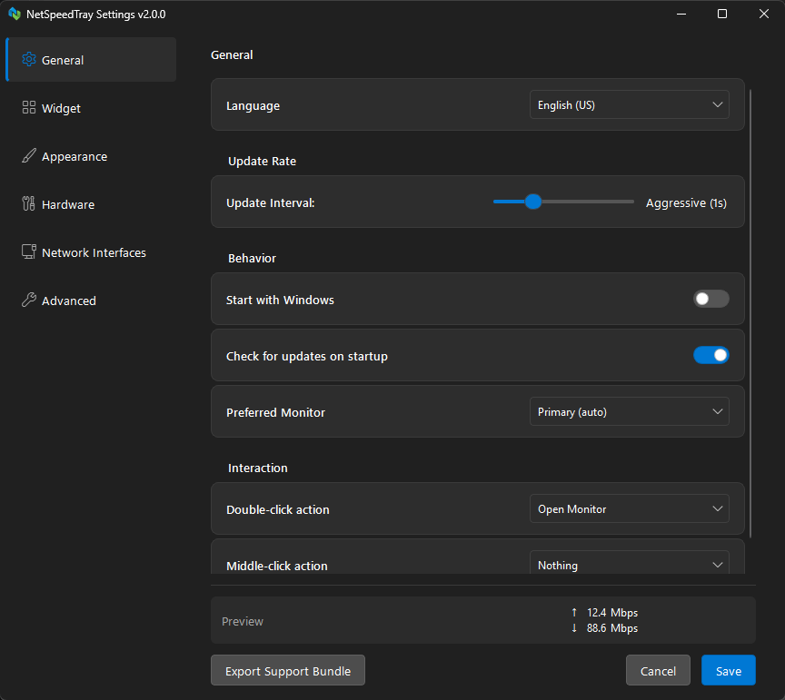

<div align="center">

# NetSpeedTray

     [](https://github.com/microsoft/winget-pkgs) 


**Live network speeds, CPU/GPU stats, temperatures, and power draw - right on your Windows taskbar.**
Open source, signed, no ads, no telemetry. The feature Windows forgot.

[**Install**](#install) · [**Features**](#what-you-get) · [**The Monitor**](#the-monitor) · [**Hardware & temperatures**](#hardware-monitoring---do-i-need-librehardwaremonitor) · [**FAQ**](#faq) · [**Support 💛**](#-support-netspeedtray)

</div>

> 🎉 **v2.0 is here - the biggest release yet.** The widget now **docks to the taskbar itself**, so it
> no longer vanishes behind the Start menu or system flyouts. And everything beyond the readout moved into
> one calm window - the new **Monitor** - with history charts, honest per-app and per-process detail,
> exportable statistics, network latency, and data-usage tracking. [Read the release notes →](https://github.com/erez-c137/NetSpeedTray/releases/latest)

---

## Install

```powershell
winget install --id erez-c137.NetSpeedTray
```

Or grab the latest [**Setup.exe** or **Portable.zip**](https://github.com/erez-c137/NetSpeedTray/releases/latest) directly. Both are digitally signed - no SmartScreen warnings.

**Requirements:** Windows 10 or 11 (64-bit). The widget needs no admin rights. CPU/GPU **temperatures** on some hardware need an optional helper - [see below](#hardware-monitoring---do-i-need-librehardwaremonitor).

---

## See it in action

The widget lives on your taskbar - at its simplest, just your up &amp; down speeds:

<div align="center">
  
</div>

<details>
  <summary>&nbsp;&nbsp;<b>➕ Show more on the taskbar</b> - mini-graph, CPU/GPU/RAM, temps &amp; power</summary>
  <br/>
  <div align="center">
  <table>
    <tr>
      <td align="right"></td>
      <td align="left">&nbsp;&nbsp;+ a live mini-graph</td>
    </tr>
    <tr>
      <td align="right"></td>
      <td align="left">&nbsp;&nbsp;+ CPU / GPU / RAM, temps</td>
    </tr>
    <tr>
      <td align="right"></td>
      <td align="left">&nbsp;&nbsp;everything at once</td>
    </tr>
  </table>
  </div>
</details>

<p align="center">Double-click it for the <b>Monitor</b> - the whole story behind the numbers:</p>

<div align="center">
  
  <p><sub><b>Overview.</b> Live tiles + adaptive sparklines, a network hero with inline latency, a data-usage card, and top talkers - every card drills into detail.</sub></p>
</div>

<p align="center"><i>↓ Click to explore the rest ↓</i></p>

<details>
  <summary>&nbsp;&nbsp;<b>🌐 Network</b> - history graph + honest per-app connections</summary>
  <br/>
  <div align="center">
    
    <p><sub>Up/down history over a live per-app <b>connection</b> list - how many each program holds, how many are active, and the distinct hosts it reaches - with a per-NIC filter. No fake per-app "speeds": Windows can't attribute network bytes per app without a driver, so nothing is dressed up.</sub></p>
  </div>
</details>

<details>
  <summary>&nbsp;&nbsp;<b>🖥️ Hardware</b> - combined CPU/GPU graph + per-process usage</summary>
  <br/>
  <div align="center">
    
    <p><sub>A combined CPU + GPU + RAM history graph over a live per-process <b>CPU / RAM / GPU%</b> list, plus a telemetry band of temperatures, power, and memory.</sub></p>
  </div>
</details>

<details>
  <summary>&nbsp;&nbsp;<b>⚙️ Settings</b> - six pages, a live preview, and a Windows 11 feel</summary>
  <br/>
  <div align="center">
    
    <p><sub><b>Appearance</b> - fonts, colours, and arrow-style presets, with a live widget preview at the bottom that updates as you change things.</sub></p>
    <br/>
    
    <p><sub><b>General</b> - language, update rate, behaviour, preferred monitor, and configurable double-/middle-click actions. Six pages in all: General · Widget · Appearance · Hardware · Network · Advanced.</sub></p>
  </div>
</details>

---

## Why NetSpeedTray?

Windows has shown network usage in Task Manager since forever - but you have to *open Task Manager to see it*, and it's gone the moment you click away. That's the gap I wanted to fill on my own machine, and I couldn't find a widget I trusted to do it cleanly.

So I built NetSpeedTray: live up/down speeds, CPU and GPU utilization, temperatures, and power draw - all sitting in your taskbar where you can glance at them without breaking your flow. No browser tab open, no third process to babysit, no telemetry, no ads, no tracking. Built with Python and PyQt6, and signed by the [SignPath Foundation](https://signpath.org/) so it installs cleanly.

---

## What You Get

🌐 **Network on your taskbar.** Live upload and download speeds with sub-second updates. Auto-detects your primary internet connection or lets you pick specific adapters. Color-code thresholds so heavy traffic stands out at a glance. In 2.0 the readout sits *inside* the taskbar's layer - it stays put through the Start menu, Quick Settings, and the tray overflow instead of disappearing.

🖥️ **Hardware stats too.** CPU and GPU utilization beside your network speeds, with optional temperature, power (Watts), RAM, and VRAM. Vendor-agnostic GPU support - NVIDIA, AMD, and Intel. ([When do temps need a helper? →](#hardware-monitoring---do-i-need-librehardwaremonitor))

📊 **The Monitor.** One window, three tabs - **Overview, Network, Hardware** - with history charts, per-app connections, per-process resource use, and statistics you can export to CSV/JSON. Double-click the widget to open it.

📈 **Usage & data caps.** Daily / weekly / monthly totals, a settable monthly cap with a billing reset day, and opt-in 80% / 100% alerts - shown as a quiet flyout above the widget, no extra tray icon.

🩺 **Network latency.** An opt-in probe shows a plain-word verdict - **Internet: Good / OK / Slow** - with the milliseconds as quiet subtext. Defaults to your gateway (stays on your LAN).

🎨 **Make it yours.** Layout modes, fonts, decimals, arrow styles, color thresholds, a mini-graph overlay, light/dark auto-theming, and a live preview in Settings that shows the exact effect before you commit.

🔒 **Trustworthy by design.** Open source under GPLv3. Signed installer, zero ads/tracking/telemetry, logs auto-redacted of paths/IPs/MACs/hostnames, and an in-app updater that *verifies the signature* before running anything. And it stays free: GPLv3 means that even if I lose interest or get hit by a bus, the code can't be bought, closed, or paywalled out from under you - anyone can fork it.

---

## The Monitor

Double-click the widget (or pick **Monitor** from the right-click menu) to open it. One window replaces the two older, separate Graph and App Activity windows. Three tabs share a single graph engine and timeline - and the Overview is intentionally chart-free, so a quick glance never loads the heavy plotting libraries.

- **🏠 Overview - the at-a-glance control center.** Live tiles for network, CPU, GPU, RAM, and VRAM, each with a sparkline that adapts its scale so low-but-varying activity reads in detail. A network "hero" card shows download and upload as co-equal headline numbers with an inline latency read, a context strip across the top (session uptime, period totals, CPU + GPU power), a **Data usage** card, and a **Top talkers** list. Every card is clickable and drills into detail.

- **🌐 Network - history + who's actually talking.** The history graph over a per-app **connection** list: how many live connections each program holds, how many are active, and the distinct remote hosts it's reaching. Honest by design - Windows can't attribute network bytes per app without a kernel driver, so nothing is dressed up as a per-app "speed." A per-NIC filter scopes both the graph and the totals.

- **🖥️ Hardware - the system, in depth.** A combined CPU + GPU history graph (with separate-axis and one-at-a-time modes, optional smoothing, and a fixed/auto y-axis) over a live per-process **CPU / RAM / GPU%** list, plus a telemetry band of temperatures, power, and memory.

- **📐 Honest statistics & export.** Click any card for a **Statistics** sheet: the real distribution (min / avg / peak, with percentiles shown only where they're exact), peak vs off-peak, throttle and connection-drop counts. **Copy** or **Export** the window to a CSV + JSON bundle - and there's a headless `NetSpeedTray.exe --export-csv` for scripted/automation use.

- **⏯️ Live / Pause & a Windows 11 feel.** Freeze a chart to read a moment, then resume. Native dark title bar and rounded corners, a Fluent tab strip, remembered size/position/last-tab, a default size that fits the whole Overview without scrolling, and full keyboard navigation (Tab to the cards and tabs, Enter/Space to drill in).

---

## Hardware Monitoring - do I need LibreHardwareMonitor?

**Utilization is always free.** CPU, GPU, RAM, and VRAM **usage** read natively through Windows performance counters and psutil - no admin, no helper, all vendors. That part just works.

**Temperatures and power are the nuanced bit.** NetSpeedTray tries native sources first and only falls back to [LibreHardwareMonitor](https://github.com/LibreHardwareMonitor/LibreHardwareMonitor) (LHM) when it has to. Whether you need LHM depends on your hardware:

| Reading | Works natively (no helper, no admin) | Needs LHM (run as admin) for full coverage |
|---|---|---|
| CPU / GPU / RAM / VRAM **usage %** | ✅ always | - |
| **GPU temperature** | ✅ NVIDIA (via `nvidia-smi`) | AMD & Intel discrete GPUs |
| **GPU power** | ✅ NVIDIA + Intel iGPU | AMD GPUs |
| **CPU temperature** | ⚠️ only if your board exposes ACPI thermal zones | AMD Ryzen, and boards without usable zones |
| **CPU power** | ✅ Intel (RAPL) | AMD CPUs |

**In plain terms:** on a typical **NVIDIA + Intel** PC you'll see most temps and power without installing anything. If you have an **AMD CPU**, accurate CPU temperature and power realistically need LHM. To enable it, install **[LibreHardwareMonitor v0.9.4](https://github.com/LibreHardwareMonitor/LibreHardwareMonitor/releases/tag/v0.9.4)** (that specific version - see the note below), run it **as Administrator**, and NetSpeedTray detects it automatically - temps and power across all vendors light up.

> NetSpeedTray itself **never runs as admin and never ships a kernel driver.** Reading CPU/GPU die
> temperatures requires a driver that Windows doesn't expose to normal apps; LHM provides that driver and
> publishes the values over WMI, which NetSpeedTray simply reads. **Use [LHM v0.9.4](https://github.com/LibreHardwareMonitor/LibreHardwareMonitor/releases/tag/v0.9.4):** LibreHardwareMonitor removed that WMI
> interface in v0.9.5, so v0.9.4 is the last version NetSpeedTray can read today (support for LHM's newer
> web-server interface is planned). Your choice, fully optional.

---

## Quick Start

1. **Install** with the Winget command [above](#install) (or the installer).
2. **Right-click the widget** - open **Settings** or the **Monitor**, **Pause/Resume** monitoring, or **Exit**. The top of the menu shows your data used today / this month at a glance.
3. **Double-click the widget** to open the **Monitor** (history, per-app activity, hardware, statistics).
4. **Drag it to reposition** - grab the widget and drag it along the taskbar to wherever you like; it remembers the spot. Turn on **Free Move (No Snapping)** in Settings to place it anywhere, including off the taskbar.
5. **Want temperatures?** Most NVIDIA/Intel systems show them out of the box. For full coverage (or any AMD CPU), install and run [LibreHardwareMonitor **v0.9.4**](https://github.com/LibreHardwareMonitor/LibreHardwareMonitor/releases/tag/v0.9.4) as Administrator (v0.9.5+ removed the interface NetSpeedTray reads).

---

## FAQ

**How is this different from Task Manager?**
Task Manager shows network speed too - but you have to *open* it, and it disappears the moment you click away. NetSpeedTray lives permanently on your taskbar with sub-second updates, in the corner of your eye while you work.

**Will it slow down my PC?**
Idle RAM is about **50 MB** - that's the number Windows Task Manager shows you (its *full* working set, which counts the shared Windows/Qt DLLs it maps, is ~90 MB), and CPU sits near zero between polls (~0.1%). The Monitor's Overview tab is deliberately chart-free, so glancing at it stays light; opening the Network or Hardware **charts** loads the plotting library for the session, which adds roughly **50-60 MB** while the Monitor is open - close the Monitor and it eases back down. The widget polls every ~1 second using the same Windows APIs Task Manager uses.

**Do I need LibreHardwareMonitor?**
Often no - see the [hardware table above](#hardware-monitoring---do-i-need-librehardwaremonitor). Usage stats and NVIDIA/Intel temps & power work natively; LHM (run as admin, **v0.9.4** - v0.9.5+ dropped the interface we read) is the universal fallback and the realistic way to get **AMD CPU** temperature and power. The widget never asks for admin itself.

**Can I set a data limit and get warned?**
Yes - **Settings → Network → Data usage**, or the tray's **Data cap…**. Set a monthly cap, a billing reset day, and opt-in 80% / 100% alerts. The alert is a quiet flyout above the widget; the tray shows live progress.

**Does the latency check phone home?**
Only if you ask it to. The default target is your own **gateway**, which never leaves your LAN. Pinging a public host is a separate, explicit opt-in where *you* choose the host. Nothing else about your network is sent anywhere - there's no telemetry of any kind.

<a id="why-does-the-network-name-need-location-access"></a>
**Why does the network name need "Location" access?**
The Wi-Fi **band** (2.4G / 5G) shows on any PC with **no permission**. The **network name (SSID)** is different: since Windows 11, Windows only hands the SSID to apps that have **Location** access - a Windows privacy gate, the same one your browser hits for Wi-Fi features. It is **not** GPS and **not** tracking: NetSpeedTray never uses your position, reads the name **locally** only to show it on the widget, and never stores or transmits it (see the [Privacy Policy](privacy.md)). Prefer not to? Leave "Network name" off and use the band - it needs nothing. The first time the name is blocked, NetSpeedTray shows a one-time explainer with a shortcut straight to the Windows Location setting.

**Where does it store data and settings?**
`%APPDATA%\NetSpeedTray\` - `config.json` for settings, `speed_history.db` (SQLite) for network/hardware history, and rotated logs. Everything stays local. Settings has an **Export Support Bundle** button that auto-redacts paths, IPs, hostnames, and MACs for clean bug reports.

**Does it work on Windows 7 or 8?**
Officially Windows 10 and 11 (64-bit). The taskbar APIs changed enough after Win8 that older versions aren't tested. It might work; it's not supported.

**SmartScreen says "unknown publisher" - is that a problem?**
You probably grabbed an unsigned dev build. The official releases ([Setup.exe / Portable.zip](https://github.com/erez-c137/NetSpeedTray/releases/latest)) are signed by the SignPath Foundation and shouldn't trip SmartScreen.

---

<details>
<summary><b>📋 Full Feature List</b> (click to expand)</summary>

### Network Monitoring
- **Live upload/download** on the taskbar with sub-second updates
- **Auto-primary mode** - finds your main internet connection, ignoring VPNs and virtual adapters
- **Interface filtering** - all hardware, specific adapters, or include virtual interfaces
- **Color coding** - custom speed thresholds and colors to read load at a glance
- **Network identity** - show the Wi-Fi **band** (2.4G / 5G / 6G) and, optionally, the **network name (SSID)** on the widget as a small pill; color-code it, or use **alert-only** mode to flash a red `2.4G` *only* when your PC has silently dropped to the slow band. The band needs no permission; the SSID needs Windows Location on - a Windows privacy gate, read locally and never sent ([why?](#why-does-the-network-name-need-location-access))
- **Per-app connections** (in the Monitor) - live connection counts and remote hosts per program, no admin needed

### Hardware Monitoring
- **CPU & GPU utilization** on the taskbar - always native (psutil + Windows PDH), all vendors, no admin
- **RAM & VRAM** usage (VRAM shows "N/A" instead of a fake 0 when no dedicated-VRAM counter exists)
- **Temperatures** - sourced in order: NVIDIA `nvidia-smi`, ACPI thermal zones (PDH), LibreHardwareMonitor/OpenHardwareMonitor (WMI), legacy ACPI WMI
- **Power (Watts)** - CPU (Intel RAPL → LHM) and GPU (NVIDIA → Intel iGPU RAPL → LHM); an opportunistic whole-system figure on laptops running on battery. Desktops can't read true wall power in software, so the Monitor honestly shows the CPU + GPU breakdown
- **LibreHardwareMonitor auto-detection** - if LHM/OHM is running as admin, it's picked up automatically for temps/power across all vendors

### The Monitor
- **Overview** - at-a-glance tiles + adaptive sparklines, a network hero card, a context strip, a Data-usage card, and Top talkers
- **Network** - history graph + per-app connection list + per-NIC filter + detail panel
- **Hardware** - combined CPU+GPU graph (modes/smoothing/axis) + per-process CPU/RAM/GPU% + telemetry band
- **Statistics & export** - honest distributions (exact percentiles only where the data supports them), Copy/Export to CSV + JSON, and a headless `--export-csv` CLI
- **Live / Pause**, remembered window state, native Win11 chrome, full keyboard navigation
- **3-tier retention** - raw (24h) → minute (30d) → hourly (up to "Keep everything"), for network *and* hardware

### Widget Layout & Customization
- **Layout modes** - Side-by-Side, Stacked, or Auto-Cycle (rotates Network / CPU / GPU); per-segment ordering
- **Mini-graph overlay** with adjustable opacity and gradient fill
- **Arrow styles** - Classic ↑↓, Solid ▲▼, Compact ▴▾, Outline △▽, Outline Compact ▵▿, Double ⇑⇓, or Custom
- **Live settings preview** - see the exact widget effect (font/color/arrows/layout/mode) before you commit
- **Configurable click actions** - reassign double-click / middle-click on the widget (Open Monitor, Settings, Pause/Resume, or nothing)
- **Auto-theme** for light/dark/mixed taskbars, **font & precision** control, **fixed-width** values to prevent jitter
- **Units** - Bits (Mbps), Bytes (MB/s), Binary (MiB/s), or Decimal, with toggleable suffixes

### Positioning & Integration
- **Taskbar-docked** - stays above the taskbar through the Start menu, flyovers, and the tray overflow
- **Drag to reposition** - drag the widget to move it along the taskbar; your spot is remembered. **Free Move (No Snapping)** lets you place it anywhere, including off the taskbar
- **Preferred monitor** - pin to a specific display (auto free-floats on a taskbar-less screen)
- **Survives** sleep/resume, monitor add/remove/primary-swap, and Explorer restarts
- **Vertical taskbar** + **high-DPI** aware

### Accessibility
- **Keyboard-navigable Monitor** - Tab to cards and tabs (accent focus ring), Enter/Space to activate, accessible names for screen readers
- **Reduce motion** - app-wide flag, and automatic respect for the Windows "Animation effects" setting

### Security & Privacy
- **Digitally signed** by the [SignPath Foundation](https://signpath.org/) - no SmartScreen warnings
- **100% open source** (GPLv3) - no ads, no tracking, no telemetry · [Privacy Policy](privacy.md)
- **PII obfuscation** - logs auto-redact paths, IPs (incl. IPv6), MACs, hostnames, and interface GUIDs
- **Latency boundary** - off by default; gateway-only unless you explicitly opt in to a public host you name
- **Verified updates** - the in-app updater authenticates the installer (Windows `WinVerifyTrust` + a publisher pin) before running, with a GitHub fallback
- **Support Bundle** - one-click sanitized zip of logs + config + system info for bug reports

### Localization
- **10 languages:** English, Korean, French, German, Russian, Spanish, Dutch, Polish, Slovenian, Japanese
- 100% key parity across all locales

</details>

---

## 💛 Support NetSpeedTray

NetSpeedTray is **free, open source, and always will be** - no ads, no telemetry, no "Pro" tier, no upsells, and no plans to ever monetize it. It's built and maintained by one person, in spare time, because I wanted it on my own taskbar and figured others might too.

I'm not doing this for the money - but I'd be lying if I said a little support doesn't help. If NetSpeedTray has earned a permanent spot on your taskbar, a one-time tip (or a few dollars a month) goes directly to the time it takes to fix bugs, ship features, and answer issues. When it's one person doing all of it, even the price of a coffee genuinely makes a difference.

<p align="center">
  <a href="https://github.com/sponsors/erez-c137">
    
  </a>
   
  <a href="https://ko-fi.com/erezc137">
    
  </a>
   
  <a href="https://buymeacoffee.com/erez.c137">
    
  </a>
</p>

**No pressure, ever** - the app is never paywalled and never will be. If money isn't an option, three free things help just as much:

- ⭐ **Star the repo** - one click, and it genuinely helps others find the project.
- 🐛 **File a good bug report** - use the [template](https://github.com/erez-c137/NetSpeedTray/issues/new?template=bug_report.yml) and attach a Support Bundle; it saves me real triage time.
- 🌍 **Improve a translation** - German and Spanish especially could use a native-speaker review. See [TRANSLATORS.md](TRANSLATORS.md).

---

## Translators

NetSpeedTray's UI lives in 10 languages thanks to the people below. Each translation is real time and care - if you use NetSpeedTray in your language, please give them a star and a thank-you.

| Language | Locale | Translator |
|---|---|---|
| 🇰🇷 Korean | `ko_KR` | [@VenusGirl](https://github.com/VenusGirl) ❤ |
| 🇳🇱 Dutch | `nl_NL` | [@CMTriX](https://github.com/CMTriX) |
| 🇷🇺 Russian | `ru_RU` | [@ZeoNish](https://github.com/ZeoNish) |
| 🇸🇮 Slovenian | `sl_SI` | [@anderlli0053](https://github.com/anderlli0053) (Andrew Poženel) |
| 🇵🇱 Polish | `pl_PL` | FadeMind |
| 🇫🇷 French | `fr_FR` | [@logounet](https://github.com/logounet) |
| 🇯🇵 Japanese | `ja_JP` | [@coolvitto](https://github.com/coolvitto) |
| 🇩🇪 German | `de_DE` | Maintainer - **native-speaker review welcome** |
| 🇪🇸 Spanish | `es_ES` | Maintainer - **native-speaker review welcome** |

See [TRANSLATORS.md](TRANSLATORS.md) for how translation works and how to contribute fixes or new languages. Even one-line phrasing corrections are valuable.

---

<details>
<summary><b>🛠️ Building from Source</b> (click to expand)</summary>

### Prerequisites
- [Python 3.11+](https://www.python.org/downloads/)
- [Git](https://git-scm.com/downloads/)
- *(Optional)* [Inno Setup 6](https://jrsoftware.org/isinfo.php) for the Windows installer
- *(Optional)* UPX - auto-downloaded by the build script into `build/tools/` if missing

### Steps

```bash
# 1. Clone
git clone https://github.com/erez-c137/NetSpeedTray.git
cd NetSpeedTray

# 2. Virtual environment (PowerShell)
python -m venv .venv
.\.venv\Scripts\Activate.ps1

# 3. Dependencies
pip install -r dev-requirements.txt

# 4. Run from source
python src/monitor.py

# 5. Run the tests
pytest -v

# 6. Build
.\build\build.bat            # full signed installer + portable zip
.\build\build-exe-only.bat   # exe only (faster iteration)
```

Output lands in `dist/`. *(Python 3.13+ pre-release? add `--pre` to the pip install if stable wheels aren't out yet.)*

</details>

---

## Contributing

Issues and pull requests welcome. Use the [bug report template](https://github.com/erez-c137/NetSpeedTray/issues/new?template=bug_report.yml) for bugs and the [feature request template](https://github.com/erez-c137/NetSpeedTray/issues/new?template=feature_request.yml) for ideas. Even small things - a typo, a clearer error message, a translation polish - are very welcome.

---

## Sponsors

Free Windows code signing for open source by [**SignPath.io**](https://signpath.io/), certificate by the [**SignPath Foundation**](https://signpath.org/).

<p align="center">
  <a href="https://signpath.io/">
    
  </a>
   
  <a href="https://signpath.org/">
    
  </a>
</p>

Every release you download from this repo is signed end-to-end - no SmartScreen warnings, no "unknown publisher," and a verifiable chain that the binary hasn't been tampered with since it left CI. SignPath donates this to qualifying open-source projects, and NetSpeedTray couldn't ship signed builds without them.

---

## Thanks

- **Translations** by the community - see [Translators](#translators) above.
- **Built on** [PyQt6](https://www.riverbankcomputing.com/software/pyqt/), [matplotlib](https://matplotlib.org/), [psutil](https://github.com/giampaolo/psutil), [numpy](https://numpy.org/), [pywin32](https://github.com/mhammond/pywin32), [LibreHardwareMonitor](https://github.com/LibreHardwareMonitor/LibreHardwareMonitor) (when available), and [Inno Setup](https://jrsoftware.org/isinfo.php).

---

<div align="center">

[](https://star-history.com/#erez-c137/NetSpeedTray&Date)

</div>

---

## License

NetSpeedTray is licensed under the [GNU GPL v3.0](LICENSE).
