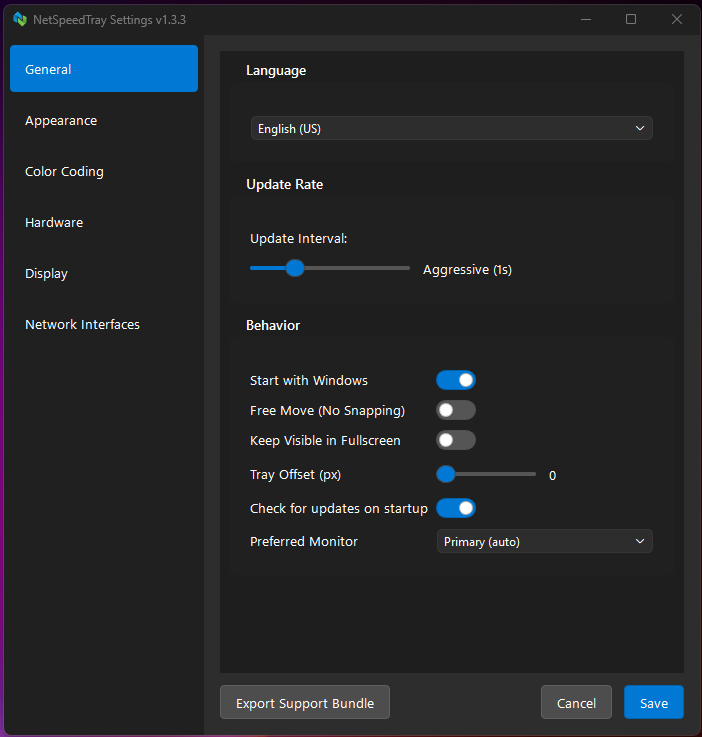
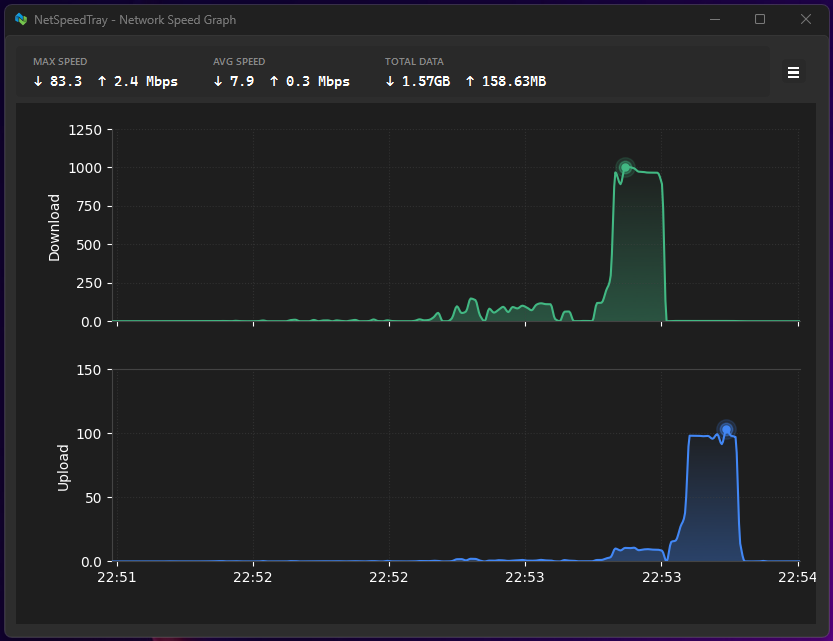

<div align="center">

# NetSpeedTray

     [](https://github.com/microsoft/winget-pkgs) 


**Live network speeds, CPU/GPU stats, temperatures, and power draw — sitting right on your Windows taskbar.**
Open source, signed, no ads, no telemetry. The feature Windows forgot.

</div>

> 🎉 **v1.3.3 is here** — Fixes the broken in-app update checker, a startup crash with Auto-Cycling, no-speed-shown on 10GbE NICs, and color-coding/fullscreen quirks, plus completes the UI translations for all 9 languages. **On v1.3.2? Please update manually — its in-app updater couldn't reach GitHub.** [Read the release notes →](https://github.com/erez-c137/NetSpeedTray/releases/tag/v1.3.3)

---

## Install

```powershell
winget install --id erez-c137.NetSpeedTray
```

Or grab the latest [**Setup.exe** or **Portable.zip**](https://github.com/erez-c137/NetSpeedTray/releases/latest) directly. Both are digitally signed — no SmartScreen warnings.

**Requirements:** Windows 10 or 11 (64-bit). No admin needed for the widget itself; LibreHardwareMonitor (optional, for CPU/GPU temperatures) does require admin.

---

## At a Glance

<table>
  <tr>
    <td align="center" width="33%">
      <br/>
      <sub><b>The Widget</b><br/>Lives on your taskbar</sub>
    </td>
    <td align="center" width="33%">
      <br/>
      <sub><b>Modern Settings</b><br/>Windows 11 styled</sub>
    </td>
    <td align="center" width="33%">
      <br/>
      <sub><b>History Graphs</b><br/>Network + CPU + GPU</sub>
    </td>
  </tr>
</table>

---

## Why NetSpeedTray?

Windows has shown network usage in Task Manager since forever — but you have to *open Task Manager to see it*. That's the gap I wanted to fill on my own machine, and I couldn't find a widget I trusted to do it cleanly.

So I built NetSpeedTray: live up/down speeds, CPU and GPU utilization, temperatures, and power draw — all sitting in your taskbar where you can glance at them without breaking your flow. No browser tab open, no third process to launch, no telemetry, no ads, no tracking. Built in Python with PyQt6 and signed by the [SignPath Foundation](https://signpath.org/).

---

## What It Does

🌐 **Network on Your Taskbar.** Live upload and download speeds with sub-second updates. Auto-detects your primary internet connection or lets you pick specific adapters. Color-coded thresholds so heavy traffic stands out at a glance.

🖥️ **Hardware Stats Too.** CPU and GPU utilization right next to network speeds. Optional temperature and power readings (Watts) for both. Vendor-agnostic GPU support — works with NVIDIA, AMD, and Intel via Windows Performance Counters. Temperatures via [LibreHardwareMonitor](https://github.com/LibreHardwareMonitor/LibreHardwareMonitor) (auto-detected), nvidia-smi, or ACPI fallback.

📊 **History Graphs.** Dual-axis area charts for download and upload. Dedicated CPU and GPU history tabs. Overview tab with synchronized charts. Three-tier retention: per-second for 24h, per-minute for 30 days, hourly up to a year. Export to CSV or save as PNG.

📍 **Multi-Monitor Aware.** Pin the widget to a specific monitor (new in v1.3.2). Free-move mode places it anywhere — including secondary monitors or off-taskbar. Adapts to vertical taskbars and high-DPI setups automatically.

🔬 **App Activity.** A separate window showing estimated per-app network usage with connection details — useful for figuring out *which* program is hammering your connection. Works in non-admin mode with reduced accuracy.

🔒 **Built to Be Trusted.** Open source under GPLv3. Digitally signed installer — no SmartScreen warnings — courtesy of free code signing from [**SignPath.io**](https://signpath.io/) with a certificate from the [**SignPath Foundation**](https://signpath.org/). Zero ads. Zero tracking. Zero telemetry. Logs are obfuscated for paths, IPs, MACs, hostnames, and interface GUIDs before they ever leave your machine.

---

## Quick Start

1. **Install** with the Winget command above (or the installer)
2. **Right-click the widget** on your taskbar — opens Settings, Graph, App Activity, or Exit
3. **Double-click the widget** to open the full history graph

Want CPU/GPU temperatures? Install [LibreHardwareMonitor](https://github.com/LibreHardwareMonitor/LibreHardwareMonitor) and run it as Administrator — NetSpeedTray detects it automatically. NVIDIA GPU temps also work natively via `nvidia-smi`.

---

## FAQ

**How is this different from Task Manager?**
Task Manager shows network speed too — but you have to *open* it to see anything, and it disappears the moment you click away. NetSpeedTray lives permanently on your taskbar with sub-second updates, in the corner of your eye while you work.

**Will it slow down my PC?**
As of v1.3.2, idle RAM is roughly 40–75 MB depending on hardware (Python + Qt overhead), and CPU usage is near zero between polls. matplotlib and numpy only load when you actually open the graph window. The widget polls network counters every ~1 second using the same Windows APIs that Task Manager uses.

**Why do I need LibreHardwareMonitor for CPU/GPU temperatures?**
Reading hardware temperatures on modern CPUs/GPUs requires a kernel-level driver that Windows doesn't expose to regular apps. LHM installs that driver and publishes temperatures via WMI, which NetSpeedTray then reads. NVIDIA GPU temps work natively via `nvidia-smi` without LHM. The widget itself never asks for admin — only LHM does.

**Does it work on Windows 7 or 8?**
Officially supported on Windows 10 and 11 (64-bit). The taskbar APIs the widget uses changed enough between Win8 and Win10 that older versions aren't tested. It might work; it's not supported.

**Where does it store data and settings?**
`%APPDATA%\NetSpeedTray\` — `config.json` for settings, `speed_history.db` (SQLite) for the network/hardware history, and rotated log files. Everything stays local; nothing leaves your machine. The Settings dialog has an "Export Support Bundle" button if you ever need to share logs for a bug report (it auto-redacts paths, IPs, hostnames, MACs).

**SmartScreen is warning about an "unknown publisher" — is this a problem?**
You probably downloaded an unsigned dev build, or grabbed a release before signing kicked in. The official releases (Setup.exe and Portable.zip on the [Releases page](https://github.com/erez-c137/NetSpeedTray/releases/latest)) are signed by the SignPath Foundation and shouldn't trigger SmartScreen.

---

<details>
<summary><b>Full Feature List</b> (click to expand)</summary>

### Network Monitoring

-   **Live Upload/Download Speeds** on the taskbar with sub-second updates
-   **Auto-Primary Mode:** Intelligently identifies your main internet connection, ignoring noise from VPNs and virtual adapters
-   **Interface Filtering:** Monitor all hardware, specific adapters, or include virtual interfaces
-   **Color Coding:** Set custom speed thresholds and colors to visualize network load at a glance
-   **App Activity Window:** See estimated per-app network usage (with a non-admin fallback mode)

### Hardware Monitoring

-   **CPU & GPU Utilization** displayed alongside network speeds on the taskbar
-   **Temperature Readouts** for CPU and GPU (via LibreHardwareMonitor, nvidia-smi, or Windows PDH/ACPI)
-   **Power Draw** in Watts for CPU (Intel RAPL) and GPU (nvidia-smi / LHM)
-   **RAM & VRAM** usage readouts
-   **Vendor-Agnostic GPU Support** via Windows Performance Counters (PDH) — works with NVIDIA, AMD, and Intel GPUs
-   **LibreHardwareMonitor Auto-Detection:** If LHM/OHM is running, NetSpeedTray picks it up automatically for temperature and power readings across all GPU vendors

### Widget Layout Modes

-   **Side-by-Side:** Network and hardware stats displayed together
-   **Stacked:** CPU + GPU in a compact column
-   **Auto-Cycle:** Rotates through Network, CPU, and GPU views
-   **Per-Segment Ordering:** Choose the display order (Network / CPU / GPU / None)

### History & Graphs

-   **Dual-Axis Area Charts** for download and upload with split view
-   **CPU & GPU History Tabs** with dedicated graphs
-   **Overview Tab** with synchronized Network/CPU/GPU charts and at-a-glance stats
-   **Symlog Scaling:** Dynamic logarithmic scale shows fine detail in idle traffic and handles Gigabit spikes
-   **Time-Dynamic Rendering:** Detailed line plots for recent data, "Mean & Range" aggregation for long-term history
-   **Data Export:** Export to `.csv` or save high-resolution `.png` snapshots
-   **3-Tier Data Retention:** Raw (24h) → Minute (30d) → Hourly (configurable) for both network and hardware stats

### Performance

-   **NumPy Vectorization** for near-instant graph rendering with years of data
-   **Lazy-Loaded Heavy Modules:** matplotlib + numpy only load when you open the graph window — idle RAM stays low (v1.3.2)
-   **Dynamic Update Rate:** Reduces polling when idle to save CPU and battery
-   **Global Debouncing:** Intelligent input debouncing prevents UI thread freezes
-   **RDP Session Detection:** Automatically detects Remote Desktop sessions, skipping GPU polling and adjusting App Activity to avoid performance issues in virtualized environments

### Visual Customization

-   **Auto-Theme Detection:** Switches text and background colors for Light, Dark, or Mixed taskbar themes — updates the moment you toggle Windows theme (v1.3.2)
-   **Fluent Design:** Modern Windows 10/11-style controls and flat card styling
-   **Free Move Mode:** Place the widget anywhere — another monitor, the desktop, a specific taskbar spot
-   **Mini-Graph Overlay:** Real-time area chart on the widget with adjustable opacity and gradient fills
-   **Arrow Styling:** Independent font, size, and weight for arrow symbols
-   **Font & Precision Control:** Custom fonts, 0-2 decimal places, fixed-width values to prevent layout jitter
-   **Text Alignment & Units:** Bits (Mbps), Bytes (MB/s), Binary (MiB/s), or Decimal units with toggleable suffixes

### Positioning & Integration

-   **Preferred Monitor:** Pin the widget to a specific display in multi-monitor setups (v1.3.2)
-   **Auto-Shift:** Finds empty space near the system tray and adjusts for new icons
-   **Z-Order Management:** Stays above the taskbar, hides for fullscreen apps and system menus, reappears instantly
-   **Tray Offset Control:** Fine-tune position relative to the system tray
-   **Vertical Taskbar Support:** Automatically adapts layout for side-mounted taskbars
-   **High-DPI Aware:** Proper scaling on 4K and multi-monitor setups

### Localization

-   Full support for **9 languages:** English, Korean, French, German, Russian, Spanish, Dutch, Polish, and Slovenian
-   100% key parity across all locales — no missing translations
-   Most translations contributed by the community — see [Translators](#translators) below

### Security & Privacy

-   **Digitally Signed** by [SignPath Foundation](https://signpath.org/) — no SmartScreen warnings
-   **100% Open Source** under GPLv3 — no ads, no tracking, no telemetry. [Privacy Policy](privacy.md)
-   **PII Obfuscation:** Logs auto-redact paths, IPs (including IPv6), MAC addresses, hostnames, and interface GUIDs before being written
-   **Support Bundle Export:** One-click sanitized zip of logs + config + system info for bug reports — no manual scrubbing needed (v1.3.2)

</details>

---

## Support This Project

NetSpeedTray is built and maintained by one person in their spare time. Every release represents real work — v1.3.2 cut the installer 24% smaller, dropped idle RAM by roughly half, fixed multi-monitor positioning, hardened PII redaction in logs, and added a one-click Support Bundle for cleaner bug reports.

If NetSpeedTray earns a permanent spot on your taskbar, a one-time tip helps me keep shipping. Even a coffee makes a real difference when it's one person doing the work.

<p align="center">
  <a href="https://github.com/sponsors/erez-c137">
    
  </a>
   
  <a href="https://ko-fi.com/erezc137">
    
  </a>
   
  <a href="https://buymeacoffee.com/erez.c137">
    
  </a>
</p>

**Can't contribute money? Three free things that genuinely help:**

- ⭐ **Star the repo** — one click, takes a second, hugely appreciated. Helps others find the project.
- 🐛 **File a good bug report** — use the [bug report template](https://github.com/erez-c137/NetSpeedTray/issues/new?template=bug_report.yml) and attach a Support Bundle. Saves me triage time.
- 🌍 **Improve a translation** — German and Spanish currently lack a native speaker reviewer. See [TRANSLATORS.md](TRANSLATORS.md).

---

## Translators

NetSpeedTray's UI lives in 9 languages thanks to the contributors below. Each translation represents real time and care — if you're using NetSpeedTray in your language, please give them a star and a thank-you.

| Language       | Locale  | Translator |
|----------------|---------|------------|
| 🇰🇷 Korean      | `ko_KR` | [@VenusGirl](https://github.com/VenusGirl) ❤ |
| 🇳🇱 Dutch       | `nl_NL` | [@CMTriX](https://github.com/CMTriX) |
| 🇷🇺 Russian     | `ru_RU` | [@ZeoNish](https://github.com/ZeoNish) |
| 🇸🇮 Slovenian   | `sl_SI` | [@anderlli0053](https://github.com/anderlli0053) (Andrew Poženel) |
| 🇵🇱 Polish      | `pl_PL` | [@FadeMind](https://github.com/FadeMind) |
| 🇫🇷 French      | `fr_FR` | [@logounet](https://github.com/logounet) |
| 🇩🇪 German      | `de_DE` | Maintainer — **native-speaker review welcome** |
| 🇪🇸 Spanish     | `es_ES` | Maintainer — **native-speaker review welcome** |

See [TRANSLATORS.md](TRANSLATORS.md) for details on how translation works in NetSpeedTray and how to contribute fixes or new languages. Even one-line phrasing corrections are valuable.

---

<details>
<summary><b>Building from Source</b> (click to expand)</summary>

### Prerequisites

-   [Python 3.11+](https://www.python.org/downloads/)
-   [Git](https://git-scm.com/downloads/)
-   (Optional) [Inno Setup 6](https://jrsoftware.org/isinfo.php) for building the Windows installer
-   (Optional) UPX is auto-downloaded by the build script into `build/tools/` if not present

### Development & Build Instructions

1.  **Clone the Repository:**

    ```bash
    git clone https://github.com/erez-c137/NetSpeedTray.git
    cd NetSpeedTray
    ```

2.  **Create and Activate a Virtual Environment:**

    ```powershell
    # PowerShell (Recommended on Windows)
    python -m venv .venv
    .\.venv\Scripts\Activate.ps1
    ```

    ```bash
    # CMD
    python -m venv .venv
    .\.venv\Scripts\activate.bat
    ```

3.  **Install All Dependencies:**

    ```bash
    pip install -r dev-requirements.txt
    ```

    > **Note for Python 3.13+ Users:** If you are using a pre-release version of Python (e.g., 3.14), you may need to install dependencies with the `--pre` flag if stable wheels are not yet available:
    > `pip install --pre -r dev-requirements.txt`

4.  **Run the Application from Source:**

    ```bash
    python src/monitor.py
    ```

5.  **Run the Test Suite:**

    ```bash
    pytest -v
    ```

6.  **Build the Executable and Installer:**
    -   **Full Package** (signed installer + portable zip):
        ```bash
        .\build\build.bat
        ```
    -   **Executable Only** (no installer, faster iteration):
        ```bash
        .\build\build-exe-only.bat
        ```
    -   Output lands in the `dist` folder.

</details>

---

## Contributing

Issues and pull requests welcome. Use the [bug report template](https://github.com/erez-c137/NetSpeedTray/issues/new?template=bug_report.yml) for bugs and the [feature request template](https://github.com/erez-c137/NetSpeedTray/issues/new?template=feature_request.yml) for ideas. Even small things — a typo, a clearer error message, a translation polish — are very welcome.

---

## Sponsors

Free code signing on Windows for open-source projects provided by [**SignPath.io**](https://signpath.io/), certificate by the [**SignPath Foundation**](https://signpath.org/).

<p align="center">
  <a href="https://signpath.io/">
    
  </a>
   
  <a href="https://signpath.org/">
    
  </a>
</p>

This means every release of NetSpeedTray you download from this repository is digitally signed end-to-end — no SmartScreen warnings, no "unknown publisher," and a verifiable chain of trust that the binary hasn't been tampered with since it left CI. SignPath donates this service for free to qualifying open-source projects, and NetSpeedTray wouldn't be able to ship signed builds without them.

---

## Thanks

-   **Translations** by the community — see [Translators](#translators) above.
-   **Built on** [PyQt6](https://www.riverbankcomputing.com/software/pyqt/), [matplotlib](https://matplotlib.org/), [psutil](https://github.com/giampaolo/psutil), [numpy](https://numpy.org/), [pywin32](https://github.com/mhammond/pywin32), [LibreHardwareMonitor](https://github.com/LibreHardwareMonitor/LibreHardwareMonitor) (when available), and [Inno Setup](https://jrsoftware.org/isinfo.php).

---

<div align="center">

[](https://star-history.com/#erez-c137/NetSpeedTray&Date)

</div>

---

## License

NetSpeedTray is licensed under the [GNU GPL v3.0](LICENSE).
